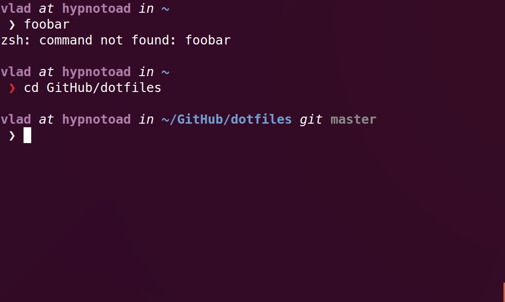

# Simple ZSH configuration

*It would be nice if your terminal emulator can render italics(SGR sequences).*

```sh
$ echo -e "\e[3mfoo\e[23m"
```




## Installation

Install Oh My Zsh.

```sh
sh -c "$(curl -fsSL https://raw.githubusercontent.com/robbyrussell/oh-my-zsh/master/tools/install.sh)"
```

Copy `.oh-my-zsh.custom`, `.zshrc.d`, `.aliases` and `.zshrc` to your home directory.

```sh
cp -r \
  .oh-my-zsh.custom \
  .zshrc.d \
  .aliases \
  .zshrc \
  ~
```
